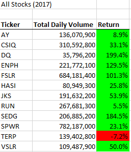
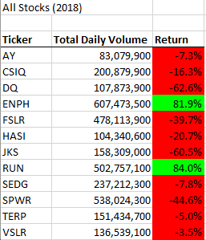
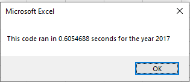
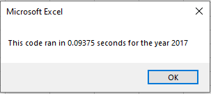
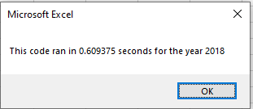
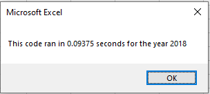

# **Analysing Green Energy Stocks to support investment decisions**
## Project overview:
- On this project I analyzed Green Energy Stock data from 2017 and 2018, to identify what would be the best option to invest in. The analysis doesn't consider external factors such as company performance, supply and demand, speculations, interest rate, etc., i.e., the analysis is based on stocks returns and daily volumes through all the year. To accomplish this analysis, I created a code using VBA to loop through all the data and collect all the information to present the stocks performance. For this I incorporated arrays, nested loops, conditional formatting, static formatting, and macro buttons to make the outcome easer to understand. Finally, this version is refactored, I made the code more efficient and readable.

## **Analysis:**

### Stocks Performance 2017:
- Table shows that only one stock (TERP) had a negative return in 2017.
- There are four stocks (DQ*, ENPH, FSLR SEDG) that double their price through the beginning and end of 2017. **DQ almost triple their price in 2017.* 
- It is possible to determine that there are two stocks (SPWR and FSLR) with very high liquidity as the number of shares traded in 2017 surpasses 6 million.
- Nevertheless, DQ was the stock with higher return but with less shares traded in 2017. This could tell us that the stock is not easy to trade.

### Stocks Performance 2018:
- 83% of the stocks had a negative return in 2018. Only ENPH and RUN had positive returns.
- ENPH and RUN had a significant increase in their number of shares trade in 2018 compared to 2017. Respectively, this represents a 174% and 88% increase.
- TERP had a two-year consecutive negative return. 
- On the other hand, ENPH and RUN where the only stocks who had positive returns in both years.

         

### Code's versions comparison:

- Refactoring the code improved its performance by reducing the execution time. Taking into a account that this was a small data set, in other scenarios the improvement would've been more impactful. 
- The refactored code ran 6 times faster that the original code.
- The code's readability was improved by adding comments to each line of the code and making it easier and smoother to read.

*Original code time*&nbsp;&nbsp;&nbsp;&nbsp;&nbsp;&nbsp;&nbsp;&nbsp;&nbsp;&nbsp;&nbsp;&nbsp;&nbsp;&nbsp;&nbsp;&nbsp;&nbsp;&nbsp;&nbsp;&nbsp;&nbsp;&nbsp;&nbsp;&nbsp;&nbsp;&nbsp;&nbsp;&nbsp;&nbsp;&nbsp;&nbsp;&nbsp;&nbsp;&nbsp;&nbsp;&nbsp;&nbsp;&nbsp;&nbsp;&nbsp;&nbsp;&nbsp;&nbsp;*Refactored code time*

   

   

## **Final conclusions:**
- There are many benefits of code refactoring, it can improve the design, readability, performance, helps identifying bugs and makes it easier to collaborate. Hence, having a *cleaner* code makes it easier to understand and improve, it is always important to consider that others will read the code and that not only affects the programmer but also the final customer who's going to have a smoother experience. On the other hand, there are also disadvantages such as time and budget. Refactoring can be time consuming and can also require more resources.
- For this project, one of the disadvantages of refactoring the code was the a

